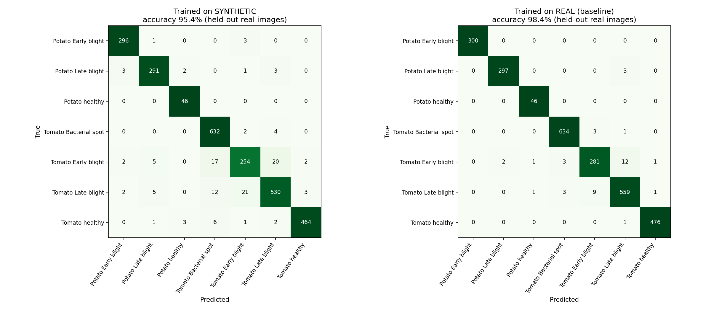

# Authenticity Gap Measurer

Quantifies **specifically which real-world edge cases** synthetic training
data fails to cover — not a generic real-vs-synthetic distribution
comparison.

**Problem statement #6272fbe4 (AI & IoT), आविष्KAR FET Hackathon**

## Key takeaways

- **Authenticity Gap Score: 33.0 / 100** — 289 of 876 hard real images have no
  good synthetic match (baseline, no crop).
- **Why they are missing:** images with a partial or small leaf in frame are
  2.18x over-represented among the missing cases; brightness, blur and
  contrast are not.
- **A fix was tested and mostly failed:** adding random crops did not move the
  targeted trait. Per class, the gentle crop helped both potato disease
  classes but hurt most tomato classes.
- **The gap matters for accuracy:** a classifier trained only on synthetic
  images reaches **96.0%** on held-out real images (98.3% when trained on real
  data), and drops to **86–89%** on the edge cases.
- **The original score is conservative:** excluding each image's own
  augmentations from the coverage check raises the gap to about **55.7**.

## Problem

Synthetic data is usually validated by comparing overall distributions
(real vs. synthetic feature statistics, e.g. FID). That hides *which* real
images the synthetic data actually fails to represent, and *why*. This
project finds the unusual, hard, real-world images (edge cases) in each
class, measures how many of them have no close match in the synthetic set,
and labels what makes them hard to represent.

## Method

1. **Feature extraction** (`extract_features.py`) — embed all real and
   synthetic images with DINOv2 (`facebook/dinov2-small`, 384-d).
2. **Edge case detection** (`find_edge_cases.py`) — score every real image by
   how unusual it is within its class using Local Outlier Factor; flag the
   top 10% per class as edge cases (876 of 8,779 images).
3. **Coverage analysis** (`coverage_analysis.py`) — for each real image, find
   the cosine distance to its nearest synthetic image of the same class. A
   per-class threshold is set at the 95th percentile of that distance among
   *normal* (non-edge) images. An edge case is **uncovered** if its distance
   exceeds that threshold.
4. **Authenticity Gap Score** = % of edge cases that are uncovered.
5. **Edge-case labelling and baseline** (`label_and_baseline.py`) — tags each
   uncovered edge case with heuristic visual traits (dark, blurry,
   overexposed, partial/small leaf, cluttered background, low contrast,
   washed-out colour), and computes a generic Fréchet-distance baseline for
   comparison.
6. **Robustness analysis** (`robustness_analysis.py`) — recomputes the score
   across different percentile thresholds (90th/95th/99th) and edge
   fractions (top 5–20%), and reports the excess over the chance level
   (since ~5% of normal images exceed the 95th-percentile cutoff by design).
7. **Accuracy check** (`accuracy_check.py`, `confusion_matrix.py`) — trains a
   classifier on synthetic images only and tests it on held-out real images
   (see *Accuracy on real images* below).

## Dataset

Crop disease leaf images, 7 classes (potato and tomato: early blight, late
blight, bacterial spot, healthy), 8,779 real images. Synthetic data is
generated by strongly augmenting the same real images (flips, rotation,
brightness/contrast/hue shifts, noise, blur, CLAHE, gamma, and — in later
versions — random resized crop). This is a limitation to note: an
independently generated synthetic set (e.g. GAN or diffusion output) was out
of scope for this timeline, but the method applies unchanged to any
synthetic source.

## Headline result (v1, no crop)

**Authenticity Gap Score: 33.0 / 100** (289 of 876 real edge cases have no
good synthetic match).

**Robust across settings:** the gap sits 18–36 points above chance level
across all 12 edge-fraction/threshold combinations tested (`report_v1/robustness_heatmap.png`).

**Specifically which, and why:** the single strongest missing trait is real
images with a **partial or small leaf in frame** — 2.18x over-represented
among missing cases compared to ordinary real images
(`report_v1/edge_case_tags.png`). Other traits (dark, blurry, overexposed,
low contrast) are *not* over-represented, meaning the synthetic pipeline's
brightness/blur/contrast augmentations already cover those well — the gap is
specifically about framing, not photometric variation.

**Why not just a generic metric:** a Fréchet-distance baseline (0.4162, vs.
a 0.0042 real-vs-real noise floor) confirms *that* a gap exists, but gives
no indication of *what* or *where*. That is exactly the limitation this
tool is built to address.

## Accuracy on real images

To check that the gap matters in practice, we trained a classifier on the
synthetic images **only** and tested it on real images it had never seen.
Features are the saved DINOv2 embeddings and the classifier is logistic
regression (`accuracy_check.py`, baseline run in `features_v1/`).

**Set-up (no leakage).** 30% of the real images are held out for testing. The
classifier is trained only on synthetic images derived from the other 70%, so
no test image (or its augmentations) is seen during training. Results are
averaged over 5 random splits. A second classifier trained on real images
gives the upper limit.

| Test group (held-out real images) | Trained on synthetic | Trained on real | Cost of synthetic training |
|---|---|---|---|
| **Overall** | **96.0%** (±0.5) | 98.3% | 2.3 pts |
| Normal images (avg n ≈ 2,378) | 96.8% | 98.6% | 1.8 pts |
| Edge cases, covered (avg n ≈ 179) | 89.3% | 95.3% | 6.0 pts |
| Edge cases, uncovered (avg n ≈ 77) | 86.1% | 94.8% | 8.7 pts |

- Edge cases are harder for every model, which supports the edge-case
  detection step.
- The cost of training on synthetic data **grows** from normal (1.8 pts) to
  covered edge cases (6.0) to uncovered edge cases (8.7), consistent with the
  gap score pointing at where synthetic data falls short.
- Caution: the covered vs. uncovered difference (89.3% vs. 86.1%) is smaller
  than the run-to-run spread, so this is *consistent with*, not proof of, the
  score predicting failures. The uncovered group is small (~77 images per
  split).

**Confusion matrix** (one split, seed 0; `confusion_matrix.py`,
`report_v1/confusion_matrix.png`):



- Synthetic-trained: 95.4% (121 errors of 2,634); real-trained: 98.4% (41
  errors).
- Almost all extra errors come from the tomato blight classes. Recall for
  Tomato Early blight falls from 93.7% to 84.7%, and Tomato Late blight from
  97.6% to 92.5%. The main confusions are Early blight vs. Late blight (about
  20 images each way) and Early blight vs. Bacterial spot (17 images).
  Potato classes and Tomato healthy are almost unaffected.

**Own-augmentation check.** Because the synthetic set is made from the same
real images, a real image's nearest synthetic neighbour can be its own
augmented copy. Recomputing the coverage test on the held-out images, with
their own augmentations excluded from the synthetic set, gives a gap score of
**55.7 (±3.8)**, much higher than the headline 33.0. This is an approximate
re-implementation on a 70/30 split, so the two numbers should not be compared
as exact equivalents, but the direction is clear: the headline score is
conservative.

## Diagnose, fix, re-measure

> **Note on folder naming:** due to renaming during experimentation, the
> saved results don't line up 1:1 with script version numbers —
> `report_v1/` = v1 (no crop), `report_v2/` = v3 (gentle crop, scale
> 0.6-1.0), `report_v2_aggressive/` = v2 (aggressive crop, scale 0.3-1.0).
> See the table below for the actual scores.

We used the tool's own diagnosis to test whether a targeted fix works. The
hypothesis: adding `RandomResizedCrop` to the synthetic generator should
produce more partial/zoomed-in leaf views and close the gap.

| Version | Crop setting | Overall gap score | `partial_or_small_leaf` lift |
|---|---|---|---|
| **v1 (baseline)** | none | **33.0** | 2.18 |
| **v3 (gentle crop)** | scale 0.6–1.0 | 35.5 | ~2.2 (unchanged) |
| **v2 (aggressive crop)** | scale 0.3–1.0 | 45.4 | 2.26 (unchanged) |

**Finding 1 — the fix didn't work as intended.** Neither crop setting moved
the `partial_or_small_leaf` lift at all. Cropping added zoom and framing
variation, but not the specific kind the missing edge cases have.

**Finding 2 — aggressive cropping actively hurts.** The strong crop
(scale 0.3–1.0) increased the overall Fréchet distance by 41% (0.4162 →
0.5867) and worsened the gap score in every single class with no exceptions.
The most likely cause: cropping to as little as 30% of the frame can cut off
the leaf entirely or zoom into a texture-less patch, making the whole
synthetic distribution less realistic without targeting the actual problem.

**Finding 3 — the gentle crop's effect is not uniform, and only the
per-class view reveals this.** The overall score for v3 (35.5) looks like a
small regression from v1 (33.0) — but that single number hides opposite
effects in different classes:

| Class | v1 (no crop) | v3 (gentle crop) | Change |
|---|---|---|---|
| Potato Early blight | 35.0% | 30.0% | **−5.0 (improved)** |
| Potato Late blight | 50.0% | 46.0% | **−4.0 (improved)** |
| Tomato Bacterial spot | 36.8% | 36.3% | −0.5 (flat) |
| Tomato healthy | 27.7% | 30.2% | +2.5 |
| Tomato Late blight | 15.8% | 23.7% | +7.9 |
| Tomato Early blight | 45.0% | 52.0% | +7.0 |
| **Potato healthy\*** | 46.7% | **86.7%** | **+40.0 (much worse)** |
| **OVERALL** | **33.0** | **35.5** | +2.5 |

\* Only 15 edge cases in this class — a couple of extra misses swings the
percentage sharply; treat this row as noisy, not a strong conclusion.

The gentle crop **helped both potato disease classes** but **made most
tomato classes worse** (Tomato Late blight +7.9, Tomato Early blight +7.0).
The Potato healthy jump looks dramatic but rests on 15 edge cases and
accounts for only about 6 of the roughly 22 additional missed edge cases;
most of the overall increase comes from the larger tomato classes. A single
overall score (35.5) would read as "the fix made things slightly worse" and
stop there — it takes the per-class, per-case breakdown this tool provides to
see that the fix helped some crops and hurt others. This is the core
capability the problem statement asks for: not just a gap number, but the
ability to evaluate *whether a proposed fix works, and where.*

## Demo

Run `python app.py` for an interactive Gradio dashboard: the overall
Authenticity Gap Score, a per-class bar chart, a before/after crop-fix
comparison tab, and a browsable gallery of the real edge-case images the
synthetic data fails to cover — each captioned with its heuristic tags
(filterable by class).

`app.py` always reads from the `report/` folder, which holds whichever
pipeline run was done most recently — **currently the v3 (gentle crop)
results, score 35.5**. To view a different version, copy that version's
folder over `report/` before launching (e.g.
`Copy-Item report_v1\* report\ -Force` for the v1 baseline), or point a
file-explorer script at `report_v2_aggressive/` directly.

## Reproduce

```bash
pip install -r requirements.txt

# generate synthetic data and extract features
python generate_synthetic.py          # or generate_synthetic_v2.py / _v3.py
python extract_features.py

# core pipeline
python find_edge_cases.py
python coverage_analysis.py
python label_and_baseline.py
python robustness_analysis.py

# compare two saved report folders
python compare_before_after.py

# accuracy on held-out real images (uses the no-crop baseline in features_v1/)
python accuracy_check.py
python confusion_matrix.py

# interactive dashboard
python app.py
```

Notes:

- `real/`, `synthetic*/` and `features*/` are not in the repo (see
  `.gitignore`). `features_v1/` (the no-crop baseline embeddings) is
  produced by running `generate_synthetic.py` and `extract_features.py`, and
  is required by `accuracy_check.py` and `confusion_matrix.py`.
- Update the `BASE`/path variables at the top of each script if your project
  folder differs from `D:\Authenticity_Gap_Project`.

## Repo structure

```
Authenticity_Gap_Project/
├── real/                        # real images, by class (not pushed — see .gitignore)
├── synthetic*/                  # synthetic image sets, all versions (not pushed)
├── features*/                   # DINOv2 embeddings, all versions (not pushed)
├── report/                      # scratch output — overwritten on every pipeline run
├── report_v1/                   # saved results — v1, no crop (score 33.0)
├── report_v1_robust/            # robustness runs for v1
├── report_v2/                   # saved results — v3, gentle crop (score 35.5)
├── report_v2_aggressive/        # saved results — v2, aggressive crop (score 45.4)
├── app.py                       # Gradio dashboard
├── extract_features.py          # DINOv2 embeddings for real + synthetic images
├── find_edge_cases.py           # flags top-10%-per-class unusual real images
├── coverage_analysis.py         # computes the Authenticity Gap Score
├── label_and_baseline.py        # heuristic tags + generic Frechet baseline
├── robustness_analysis.py       # score across thresholds/fractions + per-class breakdown
├── compare_before_after.py      # class-by-class comparison between two report folders
├── accuracy_check.py            # synthetic-trained accuracy on held-out real images
├── confusion_matrix.py          # confusion matrices (synthetic- vs real-trained)
├── generate_synthetic.py        # v1 augmentation pipeline (no crop)
├── generate_synthetic_v2.py     # v2 augmentation pipeline (aggressive crop, scale 0.3-1.0)
├── generate_synthetic_v3.py     # v3 augmentation pipeline (gentle crop, scale 0.6-1.0)
├── requirements.txt
├── .gitignore
└── README.md
```

Each saved `report*/` folder contains: `class_report.csv`,
`missing_edge_cases.csv`, `missing_edge_case_labels.csv`,
`edge_case_tag_summary.csv`, `edge_case_tags.png`, `baseline_vs_gap.csv`,
`generic_vs_edge_case.png`, `per_class_gap.csv`, `per_class_gap.png`,
`robustness_grid.csv`, `robustness_excess.csv`, `robustness_heatmap.png`,
`worst_missing_gallery.png` (plus `before_after.csv` / `before_after.png`
where a comparison was run). `report_v1/` additionally holds
`accuracy_runs.csv`, `confusion_matrix.png` and
`confusion_matrix_synthetic.csv`.

## Limitations

- Synthetic images are augmentations of real images, not independently
  generated — coverage reflects augmentation diversity as much as
  underlying data realism. The method itself is source-agnostic and applies
  unchanged to GAN- or diffusion-generated synthetic data.
- A real image's nearest synthetic neighbour can be its own augmented copy,
  which inflates coverage. The own-augmentation check above (gap ≈ 55.7 vs.
  33.0) shows the headline score is conservative, but that check is an
  approximate re-implementation on a 70/30 split, not a drop-in replacement.
- The accuracy results use logistic regression on frozen DINOv2 embeddings,
  not a fine-tuned image model, and this leaf dataset is comparatively easy.
  The uncovered-edge-case group is small (~77 images per split), so the
  covered vs. uncovered accuracy difference is within run-to-run noise.
- Edge-case tags are heuristic (brightness/sharpness/edge-density/colour
  thresholds), not human-verified; they explain fewer than half of missing
  cases (about 45% are tagged "no visible trait" under the current
  heuristics).
- The 95th-percentile threshold has a built-in ~5% chance-level uncovered
  rate; the Authenticity Gap Score should be read as relative (useful for
  comparing classes, datasets, or fixes) rather than an absolute quality
  grade.
- The `Potato___healthy` class has too few edge cases (15) for its gap score
  to be statistically reliable — large swings in this class should not be
  over-interpreted.